# Kubernetes in One Shot: Concepts, Diagrams, Labs & Interview Prep

A complete, hands-on Kubernetes guide built while following the [Kubernetes In One Shot](https://www.youtube.com/watch?v=W04brGNgxN4&t=37225s) course. **Read this README top to bottom and you will understand every core Kubernetes concept**: what it is, why it exists, how the pieces connect, how to read a manifest, and how to debug when it breaks. Every section links to a folder with ready-to-apply manifests.


---

## Table of Contents

1. [Why Kubernetes?](#1-why-kubernetes)
2. [Repository map & learning path](#2-repository-map--learning-path)
3. [Architecture & how a request flows](#3-architecture--how-a-request-flows)
4. [How to read a manifest file](#4-how-to-read-a-manifest-file)
5. [Core concepts](#5-core-concepts)
6. [Workloads](#6-workloads)
7. [Networking](#7-networking)
8. [Storage & configuration](#8-storage--configuration)
9. [Scaling & scheduling](#9-scaling--scheduling)
10. [Cluster administration](#10-cluster-administration)
11. [Monitoring & logging](#11-monitoring--logging)
12. [Advanced features](#12-advanced-features)
13. [Security](#13-security)
14. [Cloud-native Kubernetes](#14-cloud-native-kubernetes)
15. [Debugging & troubleshooting](#15-debugging--troubleshooting)
16. [End-to-end real-world example](#16-end-to-end-real-world-example)
17. [Interview questions](#17-interview-questions)
18. [Cheat sheet & quick start](#18-cheat-sheet--quick-start)

---

## 1. Why Kubernetes?

**Problem:** Running containers by hand works for one app on one server. In production you have hundreds of containers on many machines, and you need them to restart when they crash, scale with traffic, update without downtime, find each other, and keep their data.

**Solution:** Kubernetes (K8s) is a container orchestrator. You describe the **desired state** ("3 copies of this image, exposed on port 80") and Kubernetes continuously works to make reality match it.

### Monolith vs microservices

| | Monolith | Microservices |
|---|---|---|
| Deploy | One big unit | Many small services |
| Scale | Whole app together | Only the busy service |
| Failure | One bug can take everything down | Failures are isolated |
| Example | One Django app with UI, payments, search | `web`, `payments`, `search` as separate Deployments |

Kubernetes shines with microservices because it schedules, heals, scales and networks all those small services for you.

### What Kubernetes gives you

| Capability | What it means |
|---|---|
| Self-healing | Crashed containers restart; pods on dead nodes are recreated elsewhere |
| Scaling | Add or remove pods (and nodes) automatically |
| Rolling updates & rollback | Release new versions with zero downtime, undo bad ones |
| Service discovery & load balancing | Stable names and IPs for ever-changing pods |
| Config & secret management | Keep configuration out of images |
| Storage orchestration | Attach disks that survive restarts |

---

## 2. Repository map & learning path

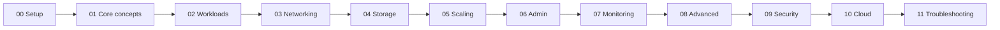

| Folder | Topics | Section |
|---|---|---|
| [`00-setup`](00-setup) | Architecture, kind, AWS EC2 setup, kubectl | [3](#3-architecture--how-a-request-flows) |
| [`01-core-concepts`](01-core-concepts) | Pods, namespaces, labels, selectors, annotations, init & sidecar | [5](#5-core-concepts) |
| [`02-workloads`](02-workloads) | Deployments, StatefulSets, DaemonSets, ReplicaSets, Jobs, CronJobs | [6](#6-workloads) |
| [`03-networking`](03-networking) | Cluster networking, Services, Ingress, Network Policies | [7](#7-networking) |
| [`04-storage`](04-storage) | PV, PVC, StorageClass, ConfigMaps, Secrets | [8](#8-storage--configuration) |
| [`05-scaling-scheduling`](05-scaling-scheduling) | HPA, VPA, affinity, taints/tolerations, quotas, limits, probes | [9](#9-scaling--scheduling) |
| [`06-cluster-administration`](06-cluster-administration) | RBAC, cluster upgrade, CRDs | [10](#10-cluster-administration) |
| [`07-monitoring-logging`](07-monitoring-logging) | Metrics Server, logging, Prometheus & Grafana | [11](#11-monitoring--logging) |
| [`08-advanced-features`](08-advanced-features) | Operators, Helm, service mesh, Kubernetes API | [12](#12-advanced-features) |
| [`09-security`](09-security) | Pod Security Standards, image scanning, secrets encryption | [13](#13-security) |
| [`10-cloud-native`](10-cloud-native) | EKS/AKS/GKE, cluster autoscaler, Spot nodes | [14](#14-cloud-native-kubernetes) |
| [`11-troubleshooting`](11-troubleshooting) | kubectl debugging, logs, resource analysis | [15](#15-debugging--troubleshooting) |
| [`my-labs`](my-labs) | My original practice files: [nginx](my-labs/nginx), [apache](my-labs/apache), [mysql](my-labs/mysql) | all |

---

## 3. Architecture & how a request flows

A cluster has a **control plane** (the brain) and **worker nodes** (where your containers run).

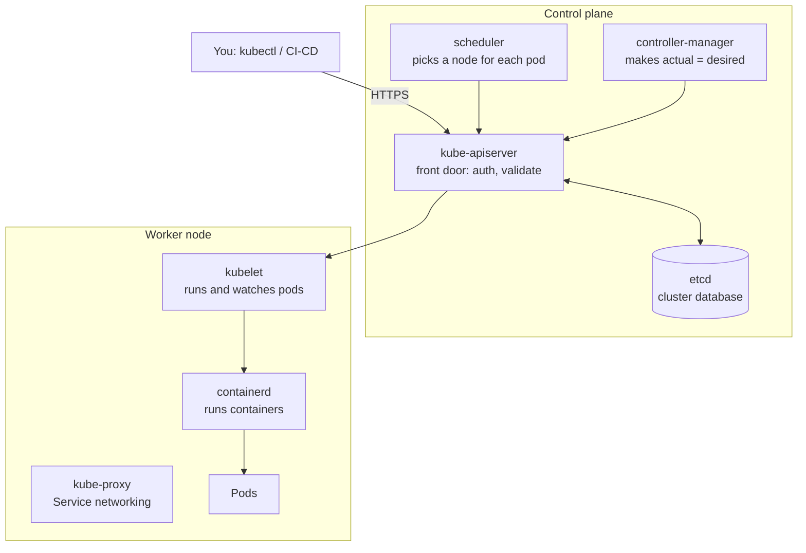

| Component | Role |
|---|---|
| **kube-apiserver** | Only entry point. Authenticates, authorizes, validates, reads and writes etcd |
| **etcd** | Key-value store holding all cluster state. Back it up! |
| **scheduler** | Chooses the best node for a new pod (resources, taints, affinity) |
| **controller-manager** | Runs controllers (Deployment, ReplicaSet, Node, Job...) that fix drift |
| **kubelet** | Agent on each node; starts containers, runs probes, reports status |
| **kube-proxy** | Programs rules so Services reach pods |
| **container runtime** | containerd/CRI-O; actually pulls images and runs containers |

### What happens on `kubectl apply -f deployment.yaml`

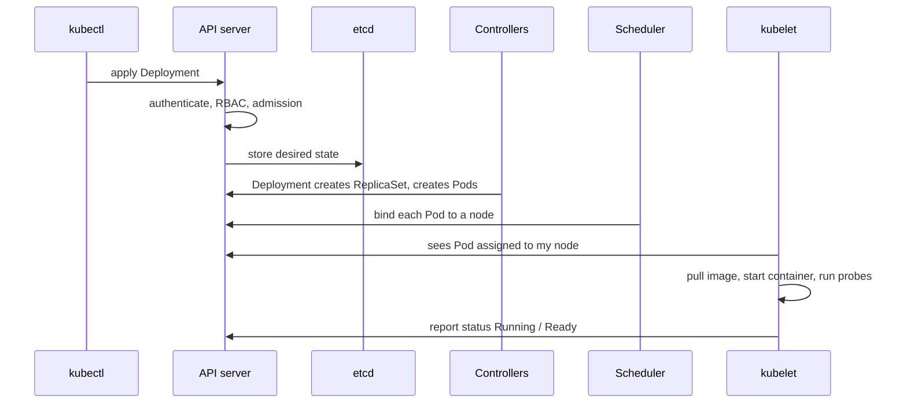

### The reconcile loop (the idea behind everything)

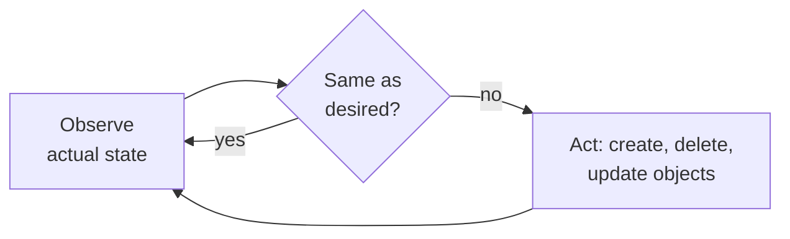

You asked for 3 pods, a node dies, 1 pod is lost: the ReplicaSet notices 2 is not 3 and creates another. This is why Kubernetes "self-heals" and why Operators work.

### Local & AWS setup

```bash
# Local: kind = Kubernetes in Docker (1 control-plane + 3 workers)
kind create cluster --name dev --config 00-setup/kind-config.yaml
kubectl get nodes
```

AWS EC2 (kubeadm): disable swap, install containerd + kubeadm/kubelet/kubectl, run `kubeadm init --pod-network-cidr=10.244.0.0/16` on the control plane, install a CNI (flannel/calico), then run the printed `kubeadm join` on workers. Full steps in [`00-setup`](00-setup).

---

## 4. How to read a manifest file

Every manifest has the same four top-level keys. Read them in this order and you can understand any YAML, even for objects you have never seen.

| Key | Question it answers |
|---|---|
| `apiVersion` | Which API group and version? (`apps/v1`, `v1`, `batch/v1`) |
| `kind` | What type of object? |
| `metadata` | Who is it? name, namespace, labels, annotations |
| `spec` | What do I want? (desired state, differs per kind). `status` is written by Kubernetes, never by you |

```yaml
apiVersion: apps/v1              # (1) API group/version for Deployment
kind: Deployment                 # (2) the object type
metadata:
  name: web                      # (3) unique name inside the namespace
  namespace: shop                # (3) WHERE it lives (forgotten = "default")
  labels: {app: web}
spec:
  replicas: 3                    # (4) desired pod count
  strategy:
    rollingUpdate: {maxSurge: 1, maxUnavailable: 0}   # zero-downtime updates
  selector:
    matchLabels: {app: web}      # (5) MUST match the template labels below
  template:                      # (6) Pod blueprint (a mini Pod manifest)
    metadata:
      labels: {app: web}         # (5) Services/ReplicaSets find pods by this
    spec:
      containers:
      - name: web
        image: myrepo/web:1.4.2  # (7) pinned tag, never :latest
        ports: [{containerPort: 8080}]
        env:
        - name: DB_PASS
          valueFrom: {secretKeyRef: {name: db-secret, key: password}}   # (8)
        resources:               # (9) requests = scheduling, limits = hard cap
          requests: {cpu: 100m, memory: 128Mi}
          limits: {cpu: 500m, memory: 256Mi}
        readinessProbe:          # (10) receive traffic only when healthy
          httpGet: {path: /healthz, port: 8080}
        livenessProbe:           # (10) restart if stuck
          httpGet: {path: /healthz, port: 8080}
```

### What to focus on most

| Priority | Focus on | Why it matters |
|---|---|---|
| 1 | **Labels and selectors** | #1 cause of "Service has no endpoints" and "Deployment won't create pods" |
| 2 | **Ports**: containerPort, Service `port` vs `targetPort` | Wrong targetPort = connection refused with healthy pods |
| 3 | **Image and tag**, imagePullSecrets | ImagePullBackOff; `:latest` makes rollouts unpredictable |
| 4 | **Resources** (requests/limits) | Pending pods, OOMKilled, HPA needs requests |
| 5 | **Probes** | Zero-downtime deploys vs restart loops |
| 6 | **Namespace** | Secrets, ConfigMaps and PVCs must be in the pod's namespace |
| 7 | **Env / volume references** | Wrong name or key = `CreateContainerConfigError` |
| 8 | **Strategy** | Controls downtime during releases |
| 9 | **securityContext, serviceAccountName** | Least privilege |
| 10 | **Scheduling** (affinity, tolerations) | Pods stuck Pending on tainted nodes |

### The label wiring (most important diagram)

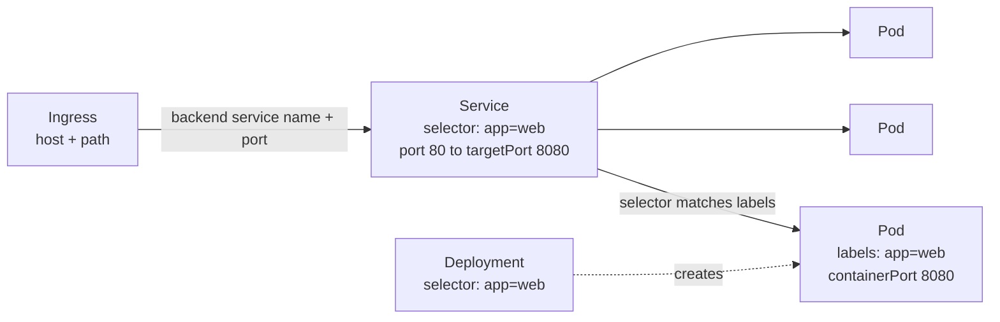

If traffic fails, check these three links: Ingress backend = Service name/port; Service selector = Pod labels; Service `targetPort` = container port. `kubectl get endpoints <svc>` must not be empty.

### Reading shortcuts

```bash
kubectl explain deployment.spec.strategy --recursive     # built-in docs
kubectl create deploy web --image=nginx --dry-run=client -o yaml > web.yaml   # generate starter YAML
kubectl diff -f web.yaml                                 # preview changes
kubectl get pod <pod> -o yaml                            # live object incl. status
```
YAML rules: 2 spaces (no tabs), `-` starts a list item, quote values like `"true"` or `"80"`, `---` separates objects.

---

## 5. Core concepts

> Folder: [`01-core-concepts`](01-core-concepts)

**What it does:** gives containers a unit to live in and a way to organize and find everything.

| Concept | Meaning | Real-world example |
|---|---|---|
| **Pod** | Smallest deployable unit: 1+ containers sharing one IP and volumes | A web container plus a log-shipper |
| **Namespace** | Virtual cluster inside a cluster | `dev`, `staging`, `prod`, or one per team |
| **Label** | Key/value tag used to identify and group | `app=cart`, `tier=frontend`, `env=prod` |
| **Selector** | Query over labels | A Service picks pods with `app=cart` |
| **Annotation** | Non-identifying metadata (not selectable) | `owner: platform-team`, build number |

```bash
kubectl apply -f 01-core-concepts/namespace-pod-labels.yaml
kubectl get pods -n nginx --show-labels
kubectl get pods -n nginx -l 'app=nginx,env in (dev,staging)'
kubectl delete pods -l env=dev            # clean a whole environment by label
```

### Multi-container patterns

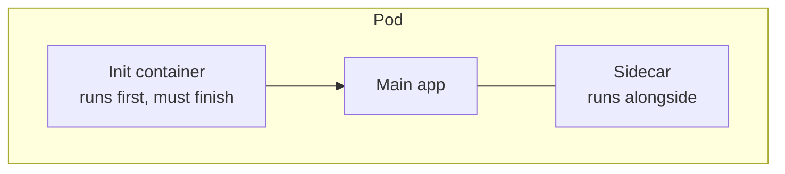

- **Init container** ([`pod-init-container.yaml`](01-core-concepts/pod-init-container.yaml)): wait for the DB, run migrations, download config.
- **Sidecar** ([`pod-sidecar.yaml`](01-core-concepts/pod-sidecar.yaml)): log shipper, proxy, secret refresher, sharing a volume with the app.

Pods are mortal: they get replaced, not repaired, and their IPs change. Never depend on a pod IP.

---

## 6. Workloads

> Folder: [`02-workloads`](02-workloads) and [`my-labs/nginx`](my-labs/nginx)

**What it does:** keeps the right number of pods running, updates them, runs stateful and batch work.

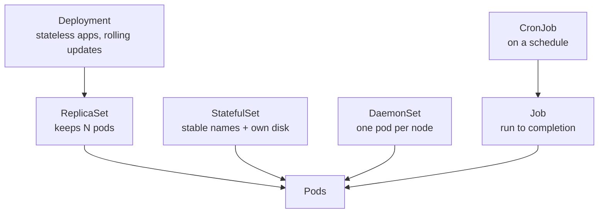

| Object | Use it for | Real-world example |
|---|---|---|
| **ReplicaSet** | Keep N identical pods | Rarely created directly |
| **Deployment** | Stateless apps, rolling update, rollback | Web storefront, REST API |
| **StatefulSet** | Stable identity + dedicated storage | MySQL, Kafka, Elasticsearch |
| **DaemonSet** | One pod on every node | Log collector, monitoring agent |
| **Job** | Task that runs once to completion | DB migration, video transcoding |
| **CronJob** | Job on a schedule | Nightly backup, weekly report |

### Rolling update (zero downtime)

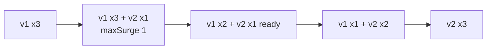

```bash
kubectl apply -f 02-workloads/deployment.yaml
kubectl set image deploy/nginx-deployment nginx=nginx:1.28 -n nginx
kubectl rollout status deploy/nginx-deployment -n nginx
kubectl rollout undo deploy/nginx-deployment -n nginx      # bad release? roll back
kubectl scale deploy/nginx-deployment --replicas=5 -n nginx
```
`maxUnavailable: 0` plus a readiness probe means a new pod must be Ready before an old one is removed.

### StatefulSet (databases)

Pods are named `mysql-0, mysql-1, mysql-2`, start in order, and each gets its own PVC. A **headless Service** (`clusterIP: None`) gives each pod DNS like `mysql-0.mysql-service.mysql.svc`. Delete `mysql-0` and it returns with the **same name and the same data**. Example: [`statefulset-mysql.yaml`](02-workloads/statefulset-mysql.yaml).

### Jobs and CronJobs

```bash
kubectl apply -f 02-workloads/job.yaml && kubectl logs job/nginx-job -n nginx
kubectl apply -f 02-workloads/cronjob.yaml
kubectl create job --from=cronjob/minute-backup manual-run -n nginx   # trigger now
```
Key settings: `backoffLimit` (retries), `ttlSecondsAfterFinished` (cleanup), `concurrencyPolicy: Forbid` (no overlap), `restartPolicy: Never|OnFailure`.

---

## 7. Networking

> Folder: [`03-networking`](03-networking)

**What it does:** gives pods stable addresses and controls who can reach whom.

**Rules of cluster networking:** every pod has its own IP, every pod can reach every other pod without NAT, implemented by a CNI plugin (Calico, Cilium, Flannel). Pod IPs change, so use **Services**.

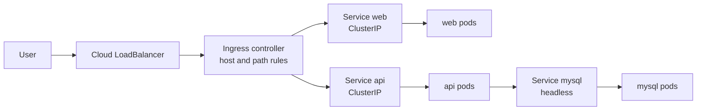

### Service types

| Type | Reachable from | Use |
|---|---|---|
| `ClusterIP` (default) | Inside the cluster | Backends, databases |
| `NodePort` | `<nodeIP>:30000-32767` | Dev and testing |
| `LoadBalancer` | Internet via cloud LB | Public app on EKS/AKS/GKE |
| Headless (`clusterIP: None`) | Per-pod DNS | StatefulSets |

DNS: `<service>.<namespace>.svc.cluster.local`, e.g. a backend connects to `mysql-service.mysql:3306`.

```bash
kubectl apply -f 03-networking/service-clusterip.yaml
kubectl get endpoints nginx-service -n nginx      # empty = selector mismatch
kubectl port-forward svc/nginx-service 8080:80 -n nginx
```

### Ingress

One entry point, many services, TLS termination. Needs an **ingress controller** (NGINX, Traefik); the Ingress is only rules.
```bash
kubectl apply -f https://kind.sigs.k8s.io/examples/ingress/deploy-ingress-nginx.yaml
kubectl apply -f 03-networking/ingress.yaml
curl -H "Host: shop.local" http://localhost/web
```

### Network Policies (pod firewall)

Default is allow-all. Deny everything, then allow only what is needed (needs a CNI that enforces them, e.g. Calico/Cilium).
```yaml
kind: NetworkPolicy
spec:
  podSelector: {matchLabels: {app: mysql}}
  policyTypes: [Ingress]
  ingress:
  - from: [{podSelector: {matchLabels: {app: backend}}}]
    ports: [{protocol: TCP, port: 3306}]
```
Real world: only the API pods may talk to the database, so a compromised frontend cannot reach it. Full example in [`network-policy.yaml`](03-networking/network-policy.yaml).

---

## 8. Storage & configuration

> Folder: [`04-storage`](04-storage) and [`my-labs/mysql`](my-labs/mysql)

**What it does:** keeps data alive beyond a container's life and keeps config and secrets out of images.

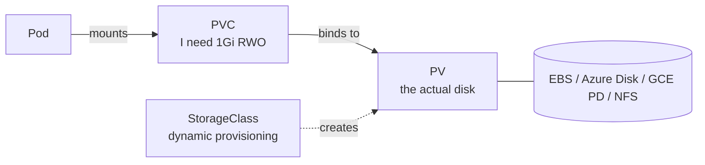

| Object | Meaning |
|---|---|
| **PV** | A piece of storage. Cluster-scoped (no namespace) |
| **PVC** | A namespaced request for storage, used by pods |
| **StorageClass** | Recipe for dynamic provisioning (gp3, Premium SSD...). PVC creates the disk automatically |
| **Access modes** | `ReadWriteOnce` (one node), `ReadOnlyMany`, `ReadWriteMany` (needs NFS/EFS) |
| **Reclaim policy** | `Retain` keeps data after PVC deletion, `Delete` removes the disk |

Real world: a Postgres pod crashes and is rescheduled; its PVC re-attaches and no data is lost.

### ConfigMap and Secret

Same image everywhere; behavior changes through config.
```bash
kubectl create configmap app-config --from-literal=LOG_LEVEL=debug
kubectl create secret generic db-cred --from-literal=password='S3cr3t!'
kubectl get secret db-cred -o jsonpath='{.data.password}' | base64 -d
```
Consume as env vars, `envFrom`, or mounted files ([`app-with-config.yaml`](04-storage/app-with-config.yaml)). Mounted ConfigMaps update live; env vars need a pod restart.

> **Secrets are only base64-encoded, not encrypted.** Enable encryption at rest and RBAC (see [Security](#13-security)) or use Vault / External Secrets / cloud secret managers.

---

## 9. Scaling & scheduling

> Folder: [`05-scaling-scheduling`](05-scaling-scheduling) and [`my-labs/apache`](my-labs/apache)

**What it does:** adds capacity when traffic grows, right-sizes pods, and decides which node each pod lands on.

### Requests, limits, QoS

- **requests**: guaranteed amount; the scheduler uses it to place the pod; HPA percentages are based on it.
- **limits**: ceiling. Over CPU limit = throttled. Over memory limit = **OOMKilled** (exit 137).
- QoS classes: Guaranteed (requests = limits) > Burstable > BestEffort (evicted first).

### Probes

| Probe | If it fails | Real-world use |
|---|---|---|
| **startup** | Keep waiting; other probes paused | Slow app taking 60s to boot |
| **readiness** | Pod removed from Service traffic | Warming cache, DB temporarily down |
| **liveness** | Container restarted | Deadlocked process |

### Three kinds of autoscaling

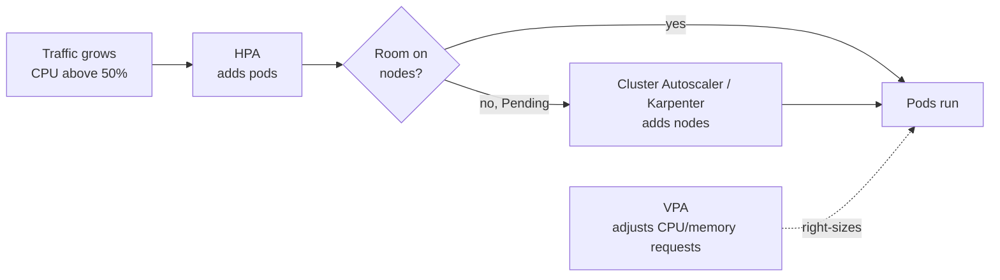

| Scaler | Changes | Needs |
|---|---|---|
| **HPA** | Number of pods | metrics-server and CPU requests |
| **VPA** | Pod CPU/memory requests | VPA components installed |
| **Cluster Autoscaler** | Number of nodes | Cloud node groups |

```bash
kubectl apply -f 05-scaling-scheduling/apache-deployment.yaml -f 05-scaling-scheduling/hpa.yaml
kubectl run load --rm -it --image=busybox -n apache -- sh -c "while true; do wget -q -O- http://apache-service; done"
kubectl get hpa -n apache -w
```
Do not run HPA and VPA on the same CPU metric for the same workload.

### Scheduling controls

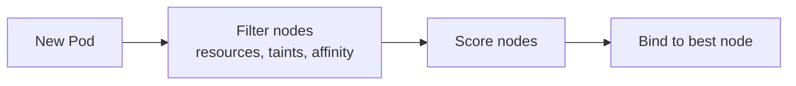

| Control | Direction | Example |
|---|---|---|
| `nodeSelector` / node affinity | Attract pod to nodes | Run on SSD nodes or one zone |
| **Taint** (node) | Repel pods | `dedicated=gpu:NoSchedule` |
| **Toleration** (pod) | Allow pod onto tainted node | GPU job tolerates the gpu taint |
| Pod anti-affinity / topology spread | Spread replicas | One replica per zone |

A toleration only *allows* scheduling on a tainted node; combine it with affinity to *force* it. See [`scheduling.yaml`](05-scaling-scheduling/scheduling.yaml).

### ResourceQuota and LimitRange

Quota caps a namespace's total CPU, memory and pod count; LimitRange sets per-container defaults. Together they stop one team starving the cluster ([`quota-limitrange.yaml`](05-scaling-scheduling/quota-limitrange.yaml)).

---

## 10. Cluster administration

> Folder: [`06-cluster-administration`](06-cluster-administration)

**What it does:** controls who can do what, keeps the cluster up to date, and extends the API.

### RBAC

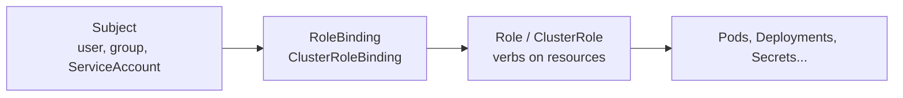

Role/RoleBinding are namespaced; ClusterRole/ClusterRoleBinding are cluster-wide. Always apply least privilege. Real world: a CI pipeline gets a ServiceAccount allowed to manage Deployments in one namespace only.
```bash
kubectl apply -f 06-cluster-administration/rbac-serviceaccount.yaml \
              -f 06-cluster-administration/rbac-role.yaml -f 06-cluster-administration/rbac-rolebinding.yaml
kubectl auth can-i delete pods -n apache --as=system:serviceaccount:apache:apache-user
kubectl create token apache-user -n apache            # short-lived token
```
The dashboard admin user (`cluster-admin`) is for learning clusters only.

### Cluster upgrade

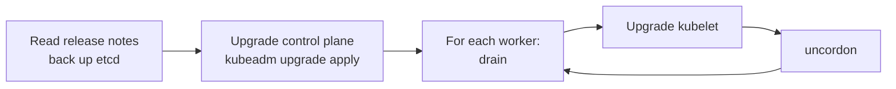
One minor version at a time. Use PodDisruptionBudgets so drains do not cause outages. Managed clouds: `eksctl upgrade cluster`, `az aks upgrade`, `gcloud container clusters upgrade`.

### Custom Resource Definitions (CRDs)

A CRD teaches the API server a new object type; it only stores data until a controller acts on it.
```bash
kubectl apply -f 06-cluster-administration/crd/devopsbatch-crd.yaml
kubectl apply -f 06-cluster-administration/crd/devopsbatch-example.yaml
kubectl get devopsbatch        # or: kubectl get dv
```
CRD + controller = **Operator** (see [Advanced](#12-advanced-features)). Examples: `Certificate` (cert-manager), `Prometheus`, `PostgresCluster`.

---

## 11. Monitoring & logging

> Folder: [`07-monitoring-logging`](07-monitoring-logging)

**What it does:** shows you problems before users do.

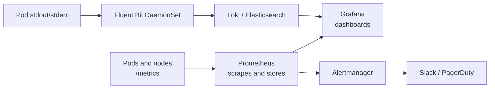

- **Metrics Server** powers `kubectl top` and HPA.
- **Logs** go to stdout/stderr and vanish with the pod; ship them off-node with a DaemonSet agent.
- **Prometheus + Grafana + Alertmanager** is the standard monitoring stack. Watch the four golden signals: latency, traffic, errors, saturation.

```bash
kubectl apply -f https://github.com/kubernetes-sigs/metrics-server/releases/latest/download/components.yaml
kubectl top nodes && kubectl top pods -A --sort-by=memory
kubectl logs <pod> -c <container> --previous -f
helm install kube-prometheus-stack prometheus-community/kube-prometheus-stack -n monitoring --create-namespace
```
On kind, metrics-server needs `--kubelet-insecure-tls`. Alert example (crash looping pods) in [`servicemonitor.yaml`](07-monitoring-logging/servicemonitor.yaml).

---

## 12. Advanced features

> Folder: [`08-advanced-features`](08-advanced-features)

### Helm: the package manager

**Problem:** many near-identical YAML files per environment. **Solution:** a chart = templates + `values.yaml`; one command installs the app, values customize it, releases are versioned.
```bash
helm install web ./08-advanced-features/helm-chart -n apache --create-namespace --set replicaCount=3
helm upgrade web ./08-advanced-features/helm-chart -f values-prod.yaml
helm history web && helm rollback web 1
helm template web ./08-advanced-features/helm-chart | less       # preview rendered YAML
```

### Operators

An Operator is a **CRD plus a controller** that encodes human operational knowledge (backup, failover, upgrades) using the reconcile loop.
```yaml
apiVersion: postgresql.cnpg.io/v1
kind: Cluster
metadata: {name: shop-db}
spec:
  instances: 3          # operator handles replication and automatic failover
  storage: {size: 5Gi}
```

### Service mesh (Istio / Linkerd)

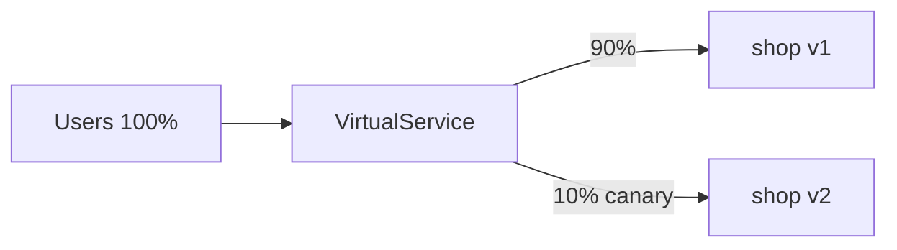
Sidecar proxies give automatic **mTLS**, retries, timeouts, **canary releases** and tracing with no code changes. Skip a mesh for a handful of services; it adds overhead. Example: [`istio-canary.yaml`](08-advanced-features/istio-canary.yaml).

### Kubernetes API

Everything (kubectl, dashboards, operators) calls the same REST API.
```bash
kubectl proxy --port=8001 &
curl localhost:8001/api/v1/namespaces/nginx/pods
kubectl api-resources && kubectl explain pod.spec
kubectl get pods -v=8                  # shows the HTTP calls kubectl makes
```
From code see [`api-access.py`](08-advanced-features/api-access.py). Inside a pod, use its ServiceAccount token; RBAC still applies.

---

## 13. Security

> Folder: [`09-security`](09-security)

**What it does:** makes sure one bad image, open pod or leaked secret cannot compromise the cluster.

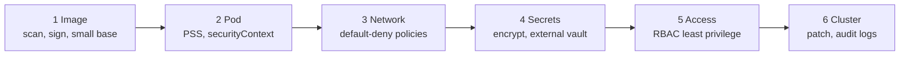

| Area | What to do | File |
|---|---|---|
| **Pod Security Standards** | Label namespaces: `privileged` < `baseline` < `restricted` (non-root, no privilege escalation, drop all capabilities) | [`pod-security-standards.yaml`](09-security/pod-security-standards.yaml) |
| **Image scanning** | Scan for CVEs in CI, pin tags/digests, use minimal base images | [`trivy-ci.yaml`](09-security/trivy-ci.yaml) |
| **Network Policies** | Default-deny, allow only required paths | [`network-policy.yaml`](03-networking/network-policy.yaml) |
| **Secrets encryption** | Encrypt Secrets at rest in etcd, or use External Secrets / Vault | [`encryption-config.yaml`](09-security/encryption-config.yaml) |

```bash
kubectl label ns apps pod-security.kubernetes.io/enforce=restricted
trivy image myrepo/web:1.4.2 --severity HIGH,CRITICAL
```
Hardened pod essentials: `runAsNonRoot: true`, `readOnlyRootFilesystem: true`, `allowPrivilegeEscalation: false`, `capabilities: {drop: ["ALL"]}`.

---

## 14. Cloud-native Kubernetes

> Folder: [`10-cloud-native`](10-cloud-native)

**What it does:** lets the cloud run the hard parts and cuts your bill.

| | AWS **EKS** | Azure **AKS** | Google **GKE** |
|---|---|---|---|
| Create | `eksctl create cluster -f eksctl-cluster.yaml` | `az aks create -g rg -n demo` | `gcloud container clusters create demo` |
| Kubeconfig | `aws eks update-kubeconfig --name demo-cluster` | `az aks get-credentials -g rg -n demo` | `gcloud container clusters get-credentials demo` |

Managed services run the highly available control plane and etcd; you manage nodes and workloads. `Service type: LoadBalancer` creates a cloud load balancer; PVCs create EBS/Azure Disk/PD volumes automatically.

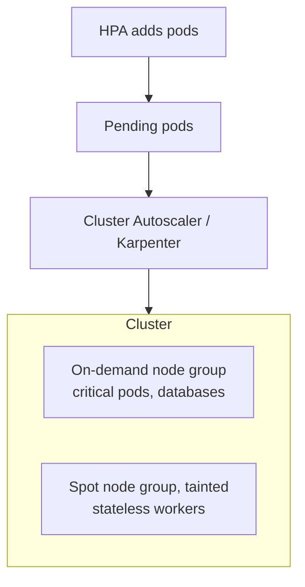

**Spot / preemptible nodes** are spare capacity at 60 to 90 percent discount that can be reclaimed with about 2 minutes notice. Use them for stateless workers, CI runners and batch jobs. Pattern: taint the Spot group, let workloads opt in with a toleration, run 2+ replicas, add a PodDisruptionBudget, handle SIGTERM gracefully ([`spot-workload.yaml`](10-cloud-native/spot-workload.yaml), [`pdb.yaml`](10-cloud-native/pdb.yaml)). Always set resource requests or autoscalers cannot compute need. Delete test clusters: they bill hourly.

---

## 15. Debugging & troubleshooting

> Folder: [`11-troubleshooting`](11-troubleshooting) (includes a practice lab with deliberately broken pods)

### The routine

```bash
kubectl get pods -o wide                       # 1. status, node, restarts
kubectl describe pod <pod>                     # 2. Events at the bottom = the "why"
kubectl logs <pod> -c <ctr> --previous         # 3. app output (previous = crashed container)
kubectl get events --sort-by=.lastTimestamp    # 4. cluster timeline
```

### Decision tree

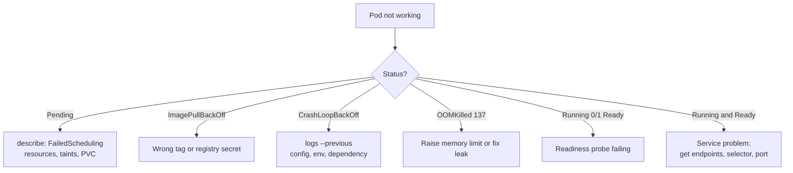

| Status | Usual cause | Fix |
|---|---|---|
| `Pending` | Not enough CPU/memory, unbound PVC, taint mismatch | Lower requests, add nodes, fix tolerations |
| `ImagePullBackOff` | Bad image/tag, private registry | Fix tag; add `imagePullSecrets` |
| `CrashLoopBackOff` | App exits (bad config, missing env, dependency down) | `logs --previous`; check ConfigMap/Secret |
| `OOMKilled` | Memory above limit | Raise limit; check `kubectl top` |
| `0/1 Ready` | Readiness probe failing | Fix probe path/port |
| `CreateContainerConfigError` | Missing ConfigMap/Secret/key | Create it or fix the name/namespace |
| `Evicted` | Node pressure | Set requests, add capacity |

### Service unreachable? Check in this order

Pod Ready, then `kubectl get endpoints`, Service port/targetPort, DNS, NetworkPolicy, Ingress and controller logs.
```bash
kubectl run dbg --rm -it --image=nicolaka/netshoot -- bash     # nslookup, curl from inside
kubectl port-forward svc/web 8080:80                           # bypass ingress to isolate the layer
kubectl debug -it <pod> --image=busybox --target=<container>   # ephemeral debug container
kubectl auth can-i --list                                      # Forbidden errors
```

### Resource usage analysis
```bash
kubectl top nodes ; kubectl top pods -A --sort-by=cpu
kubectl describe node <node> | grep -A8 "Allocated resources"
```
Memory near limit with restarts means raise limits; usage far below requests means shrink them (VPA recommendations help).

---

## 16. End-to-end real-world example

Deploy an online shop: stateless **web**, stateful **MySQL**, a nightly **backup**, public HTTPS, autoscaling and monitoring.

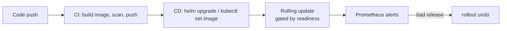

| Step | What you do | Manifest |
|---|---|---|
| 1 | Namespace per environment, quotas | Namespace, ResourceQuota |
| 2 | Config and secrets | ConfigMap, Secret |
| 3 | Database | StatefulSet, headless Service, volumeClaimTemplates |
| 4 | Web app | Deployment with pinned image, resources, probes, rolling update |
| 5 | Expose | ClusterIP Service, then Ingress with TLS |
| 6 | Protect | NetworkPolicy (web to mysql:3306 only), PSS `restricted`, ServiceAccount + Role |
| 7 | Scale | HPA on CPU; Cluster Autoscaler for nodes |
| 8 | Batch | CronJob for nightly backup, `concurrencyPolicy: Forbid` |
| 9 | Observe | ServiceMonitor, alerts on restarts and 5xx, Fluent Bit logs |
| 10 | Release | CI builds and scans, new tag, rolling update, rollback if bad |

```bash
kubectl apply -f namespace.yaml                  # 1. namespace first
kubectl apply -f configmap.yaml -f secret.yaml   # 2. things pods reference
kubectl apply -f pv-pvc.yaml                     # 3. storage
kubectl apply -f mysql-statefulset.yaml          # 4. dependencies before consumers
kubectl apply -f web-deployment.yaml -f service.yaml -f ingress.yaml
kubectl apply -f hpa.yaml -f networkpolicy.yaml
kubectl get all,pvc,ingress -n shop && kubectl rollout status deploy/web -n shop
```

---

## 17. Interview questions

**Basics**
- **Why Kubernetes over Docker alone?** Docker runs containers on one host; Kubernetes orchestrates across many with self-healing, scaling, rolling updates, discovery and config management.
- **What happens on `kubectl apply`?** API server authenticates, authorizes and validates, stores in etcd; controllers create ReplicaSet and Pods; scheduler assigns a node; kubelet pulls the image and runs it; probes decide readiness.
- **Labels vs annotations?** Labels identify and are selectable; annotations are non-identifying metadata.
- **Declarative vs imperative?** Imperative: `kubectl run/scale`. Declarative: `kubectl apply` on YAML in Git; Kubernetes reconciles. Declarative is repeatable and GitOps-friendly.

**Workloads**
- **Deployment vs StatefulSet?** Interchangeable pods vs stable names, ordered start and a PVC per pod.
- **Zero-downtime release?** Rolling update with `maxUnavailable: 0` and a readiness probe.
- **Bad release?** `kubectl rollout undo` or `helm rollback`.
- **Init container vs sidecar?** Init runs once before the app; sidecar runs alongside it.

**Networking**
- **Why Services?** Pod IPs are ephemeral; a Service gives a stable IP/DNS and load balancing.
- **Service vs Ingress?** Service is L4 for one app; Ingress is L7 host/path routing and TLS for many, and needs a controller.
- **Restrict pod traffic?** NetworkPolicy: default-deny, then allow specific selectors and ports (CNI must enforce).

**Storage and config**
- **PV vs PVC vs StorageClass?** Disk vs request for a disk vs recipe for dynamic provisioning.
- **Are Secrets secure?** Only base64 by default; enable etcd encryption, RBAC, or use an external secret manager.
- **ConfigMap update?** Mounted files refresh; env vars need a restart.

**Scaling and scheduling**
- **HPA vs VPA vs Cluster Autoscaler?** Pods vs pod size vs nodes.
- **HPA not scaling?** metrics-server missing, no CPU requests, or max replicas reached.
- **Requests vs limits?** Scheduling guarantee vs ceiling; CPU is throttled, memory is OOMKilled.
- **Taints vs affinity?** Taints repel, affinity attracts; tolerations only allow.
- **Three probes?** Startup (slow boot), readiness (receive traffic), liveness (restart).

**Security and admin**
- **RBAC?** Roles define verbs on resources; bindings attach them to users, groups or ServiceAccounts; test with `kubectl auth can-i`.
- **Pod Security Standards?** Privileged, baseline, restricted, enforced per namespace by labels.
- **How to upgrade a cluster?** Back up etcd, control plane first, then drain, upgrade and uncordon each node, one minor version at a time.
- **CRD vs Operator?** CRD adds a type; an Operator adds a controller that acts on it.

**Cloud and operations**
- **Why managed K8s?** The cloud runs and patches the control plane.
- **Spot nodes in production?** Stateless workloads only, with tolerations, 2+ replicas, PDB and graceful shutdown.
- **PodDisruptionBudget?** Keeps a minimum number of pods available during voluntary disruptions.

**Scenarios**
- **Site is down, what do you do?** `get pods`, `describe`, `logs --previous`, `get endpoints`, check Ingress and recent rollouts; roll back if a release caused it, then root-cause.
- **CrashLoopBackOff with empty logs?** Use `--previous`, read the exit code from `describe` (137 = OOM, 127 = command not found), use `kubectl debug` if the image has no shell, check that liveness is not killing a slow app.
- **Node goes NotReady?** After the eviction timeout pods are recreated elsewhere; inspect `describe node`, kubelet logs and disk/memory pressure; cordon, drain and replace if needed.
- **Cloud bill too high?** Right-size requests, scale down idle nodes, use Spot for stateless work, delete unused PVCs and load balancers.

**Answer pattern:** problem it solves, definition, real example, one gotcha.

---

## 18. Cheat sheet & quick start

```bash
# prerequisites: Docker, kubectl, kind
kind create cluster --name dev --config 00-setup/kind-config.yaml
kubectl apply -f 01-core-concepts/namespace-pod-labels.yaml
kubectl apply -f 02-workloads/deployment.yaml -f 03-networking/service-clusterip.yaml
kubectl get all -n nginx
kubectl port-forward svc/nginx-service 8080:80 -n nginx        # http://localhost:8080
kind delete cluster --name dev                                 # clean up
```

```bash
# inspect
kubectl get pods,svc,deploy -A -o wide        kubectl describe <kind> <name>
kubectl get <kind> <name> -o yaml             kubectl explain <kind>.spec --recursive
# change
kubectl apply -f file.yaml                    kubectl diff -f file.yaml
kubectl scale deploy web --replicas=5         kubectl set image deploy/web web=img:tag
kubectl rollout status|history|undo|restart deploy/web
# debug
kubectl logs <pod> -c <ctr> -f --previous     kubectl exec -it <pod> -- sh
kubectl port-forward svc/web 8080:80          kubectl top nodes|pods
kubectl auth can-i <verb> <resource> --as=<user>
# nodes
kubectl cordon|drain|uncordon <node>          kubectl taint node <n> key=val:NoSchedule
# generate YAML fast
kubectl create deploy web --image=nginx --dry-run=client -o yaml > web.yaml
```

Tip: `alias k=kubectl` and `source <(kubectl completion bash)`.

### Suggested 7-day plan

| Day | Topics | Do this |
|---|---|---|
| 1 | Setup, core concepts | Create a kind cluster; pods, labels, init/sidecar |
| 2 | Workloads | Deploy, rolling update, rollback; Job and CronJob |
| 3 | Networking | Services, Ingress, NetworkPolicy; break a selector on purpose |
| 4 | Storage and config | PVC, StatefulSet data survives pod deletion |
| 5 | Scaling and scheduling | HPA load test, taints/tolerations, quotas |
| 6 | Admin, security, monitoring | RBAC tests, PSS label, Prometheus via Helm |
| 7 | Cloud, troubleshooting | Fix every pod in `broken-pods.yaml`; answer the interview questions aloud |

### Notes
- Manifests use pinned image tags (not `latest`) and namespaces; apply a folder's namespace file first.
- Replace placeholder secrets (`REPLACE_WITH_A_LOCAL_PASSWORD`, `change-me`) locally and never commit real ones.
- Some labs need extras: metrics-server (HPA), VPA, an ingress controller, a Network Policy-capable CNI. The topic README says which.
- Cloud examples cost money; delete clusters after practice.

---

## License
MIT. See [LICENSE](LICENSE).